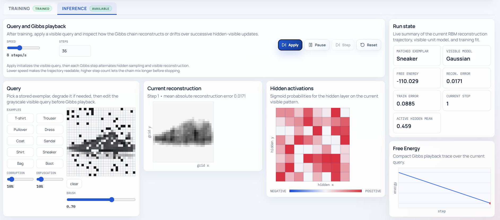

# Energy-Based Memory Models

<p align="center">
	<a href="https://github.com/pzarzycki/hopfield-energy/actions/workflows/deploy.yml">
		
	</a>
	<a href="https://pzarzycki.github.io/hopfield-energy/">
		
	</a>
	<a href="./LICENSE">
		
	</a>
</p>

<p align="center">
	Interactive implementations of classical and modern energy-based memory models,<br/>
	with a visual browser app and terminal-native validation workflow.
</p>

<p align="center">
	<a href="https://pzarzycki.github.io/hopfield-energy/"><strong>Live Demo</strong></a>
	·
	<a href="#quick-start"><strong>Quick Start</strong></a>
	·
	<a href="#included-models"><strong>Models</strong></a>
	·
	<a href="#validation-commands"><strong>Validation</strong></a>
	·
	<a href="Architecture.md"><strong>Architecture</strong></a>
</p>



## Why This Project

- Compare multiple memory models in one place
- Visualize training, reconstruction, and retrieval behavior interactively
- Validate model behavior from the terminal without requiring a browser
- Keep browser and CLI paths aligned through shared core and dataset modules

## Included Models

- Hopfield Network
- Dense Hopfield Network
- Restricted Boltzmann Machine (RBM)
- Dense Associative Memory (DAM)

### Model Matrix

| Model | Browser UI | CLI Smoke | Wasm Core |
| --- | --- | --- | --- |
| Hopfield Network | Yes | Yes | Yes |
| Dense Hopfield Network | Yes | Yes | Yes |
| Restricted Boltzmann Machine (RBM) | Yes | Yes | Yes |
| Dense Associative Memory (DAM) | Yes | Yes | Yes |

Model details and equations:

- [docs/models/hopfield.md](docs/models/hopfield.md)
- [docs/models/dense-hopfield.md](docs/models/dense-hopfield.md)
- [docs/models/restricted-boltzmann-machine.md](docs/models/restricted-boltzmann-machine.md)
- [docs/models/dense-associative-memory.md](docs/models/dense-associative-memory.md)
- [docs/models/boltzmann-machine.md](docs/models/boltzmann-machine.md)

## Quick Start

### Prerequisites

- Node.js 20+
- npm

### Install

```bash
git clone https://github.com/pzarzycki/hopfield-energy.git
cd hopfield-energy
npm install
```

### Run Locally

```bash
npm run dev
```

Default URL: `http://localhost:5173/`

### Build

```bash
npm run build
```

## Validation Commands

Main validation pipeline (recommended in devcontainer):

```bash
npm run verify:all
```

Useful targeted commands:

```bash
npm run dam:smoke
npm run rbm:smoke
npm run wasm:test
npm run wasm:build
npm run wasm:regression
```

Smoke-test examples:

```bash
npm run dam:smoke -- --dataset mnist --epochs 3 --hidden-units 64 --sharpness 6
npm run rbm:smoke -- --dataset mnist --epochs 3 --hidden-units 64 --visible-model bernoulli
```

## Runtime Targets

- Browser UI: React + workers for interactive model workflows
- CLI: Node-based smoke tests for deterministic checks
- Wasm core: Rust implementations under [wasm-core](wasm-core)

## Development Environment

Use the devcontainer for builds, tests, and smoke runs.
Canonical runtime signal: `PROJECT_RUNTIME=devcontainer`.

See:

- [AGENTS.md](AGENTS.md)
- [Architecture.md](Architecture.md)

## Project Layout

```text
hopfield-energy/
├── docs/models/                  # per-model docs and equations
├── public/datasets/              # bundled dataset archives
├── scripts/                      # CLI smoke tests and dataset tooling
├── src/core/                     # shared model logic
├── src/data/                     # shared dataset pipeline
├── src/pages/                    # React pages (presentation)
├── src/workers/                  # runtime adapters for browser execution
└── wasm-core/                    # Rust/Wasm model implementations
```

## Deployment

GitHub Actions validates and deploys the app to GitHub Pages on pushes to `main`.

Live site: https://pzarzycki.github.io/hopfield-energy/

## License

MIT
